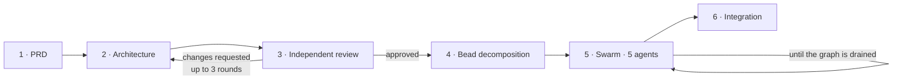
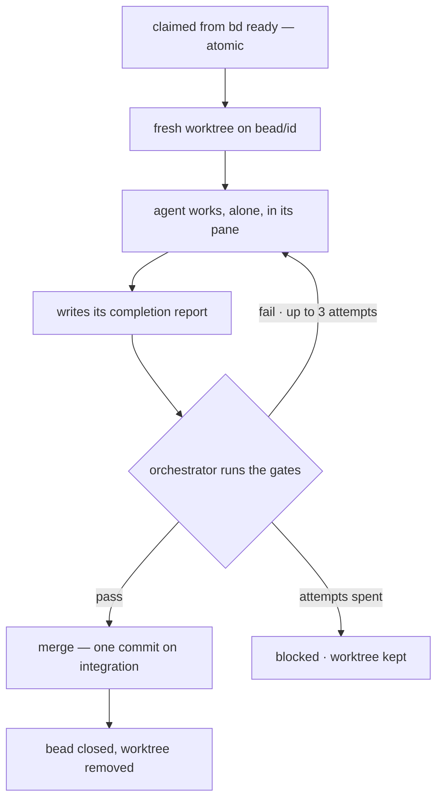

# How this pipeline works, and why

A conceptual overview. For setup see [`HANDOVER.md`](HANDOVER.md); for the
mechanics of each phase see [`PIPELINE.md`](PIPELINE.md); for the operational
playbook an agent follows see
[`../.claude/skills/agentic-pipeline/SKILL.md`](../.claude/skills/agentic-pipeline/SKILL.md).

## The problem

Point a coding agent at a feature-sized task and you get a predictable
failure. It builds something plausible, tells you it works, and leaves you to
find the parts that don't. Scale to five agents and the failures compound:
they edit the same files, duplicate each other's helpers, and disagree about
interfaces nobody wrote down.

The instinct is to fix this with better prompting. That treats the symptom.
The real problems are structural:

- **Nobody checks the design.** An architecture invented in the same
  conversation that produced the requirements inherits every assumption in
  that conversation. The mistakes are invisible from the inside.
- **Completion is self-reported.** An agent saying "done, tests pass" is a
  claim. Treated as fact, it merges broken code.
- **Parallelism has no schedule.** Without a real dependency graph, "parallel"
  means "simultaneous and conflicting".

## The central idea

Separate the thinking from the doing, and make every handoff between them a
*verifiable artifact* rather than a conversation.

A PRD is an artifact. An architecture document is an artifact. A bead — one
unit of work with acceptance criteria — is an artifact. A completion report is
an artifact, and so is the test run that confirms or contradicts it.

Because each phase hands the next a document rather than context, each phase
can be performed by an agent that knows only what it needs, and each handoff
can be inspected, rejected, or replayed. That single property is what buys
independent review, parallel execution, resumability after a crash, and a
human who can intervene at one point without reconstructing the whole run.

## The six phases



| Phase | What happens | Gate |
| --- | --- | --- |
| 1 · PRD | Interactive. The orchestrator interviews you for what's missing rather than inventing plausible requirements. | Your sign-off |
| 2 · Architecture | Designed in the main session, where the codebase is visible, so it fits what exists. | — |
| 3 · Independent review | A reviewer in a sandbox holding only the PRD and the design judges it against general principles. | No blockers, or a written rebuttal |
| 4 · Decomposition | An agent turns the design into a dependency graph of beads. | You review the graph |
| 5 · Swarm | Up to five implementers, one bead each, isolated worktrees. | Gates pass per bead |
| 6 · Integration | Full suite against the branch as a whole; de-duplicate what parallel agents produced. | — |

## Inside the swarm

One bead's journey is the whole mechanism. Five run at once, staggered, each
in a separate checkout.



Two details carry more weight than they look:

**The report file is the completion contract — not the agent going quiet.** A
pane falling idle only means the agent stopped talking; it may have crashed or
wandered off. The orchestrator waits for the report, then ignores what it
claims and runs the gates itself.

**Feedback goes back to the *same* agent.** It still holds the context of the
code it just wrote, so a retry costs one more turn rather than a fresh agent
rebuilding understanding from nothing. Merge conflicts route the same way, for
the same reason.

**A blocked bead doesn't stall the graph.** After the attempts are spent it is
parked with the reason attached, its worktree preserved, and the loop moves on.
One bad bead costs you one bead.

### Why five agents don't collide

Each bead gets its own git worktree — a separate checkout on a separate
branch, sharing one object store. Parallel edits, test runs and build
artifacts physically cannot touch each other.

```
                    bead/bd-1 ─────────●
                   /                    \
                  /   bead/bd-2 ──────────────────●
                 /   /                             \
                /   /   bead/bd-3 ──────────────────────────●
               /   /   /                                     \
  ──●─────────●───●───●───────────────●─────────────●─────────●──▶
    fork point                    merge(bd-1)   merge(bd-2)  merge(bd-3)
                                                pipeline/integration
```

Merges are serialised; work is not. Every bead lands as exactly one `--no-ff`
merge commit, so any single bead can be reverted afterwards. After each merge
the still-running branches are refreshed from the new tip, so late finishers
don't drift into avoidable conflicts.

## Why this shape works

**Verification beats trust, and it's cheap.** The gates — install, lint, test,
build — run in the bead's own worktree after the agent says it's finished.
This is what makes the rest safe to automate. It costs one test run per bead
and removes the entire category of "the agent was confident and wrong."
Documentation is enforced the same way: a bead that changed no docs fails
validation.

**Ignorance is a feature, deliberately applied.** The architecture reviewer is
isolated because a reviewer who watched a design evolve accepts reasoning it
should be attacking. Implementers are isolated because an agent that can see
four other beads will helpfully "fix" them and produce a merge conflict. It
has a second effect that matters commercially: every agent's context stays
small and on-task, which is cheaper, faster, and less prone to drift.

**The dependency graph is the schedule.** Nothing decides what runs in
parallel except which beads have no unsatisfied dependencies. Concurrency is
derived from the design rather than guessed, and shared interfaces land first
by construction.

**Beads are the state, so everything is resumable.** The pipeline keeps almost
nothing of its own. Kill it mid-run and the claims are released; start it
again and it picks up wherever the graph is.

### The honest tradeoff

This is heavier than asking an agent to build a feature. It pays off past a
threshold — roughly, when the work is more than one agent can hold at once, or
when being wrong is expensive. For a bug fix, six phases are pure overhead.
Use the swarm when there's a graph; use one agent when there's a task.

## The stack

| Component | Role |
| --- | --- |
| Claude Code | The orchestrator, and every agent. A *skill* encodes the playbook and the gates; subagent definitions carry the reviewer and decomposer roles. |
| beads (`bd`) | A git-backed, dependency-aware issue graph built for coding agents. Supplies the ready-set and atomic claiming. The pipeline's memory. |
| herdr | A terminal multiplexer for agents. Each implementer gets a real, attachable pane on a background server, so closing your terminal doesn't kill the run. |
| git worktrees | The isolation primitive. One checkout per bead, sharing one object store. |
| bash + jq | The loop. Deliberately boring — no runtime to install, and every `bd`/`herdr` call confined to one adapter file. |

The agent backend is swappable behind one interface: **herdr** for observable
panes, **headless** (`claude -p`) for CI, and **mock** — a scripted fake
honouring the same contract, which is how the loop is tested with no LLM and
no network in the path.

## Running it efficiently

**Throughput is decided in phase 4, not phase 5.** By the time the swarm
starts, the ceiling is fixed.

Same six beads, same five agents:

```
serial chain            ●→●→●→●→●        1 of 5 agents busy · 5 turns

interface first         ●  (shared contract)
                        ├─●
                        ├─●              5 of 5 agents busy · 2 turns
                        ├─●
                        ├─●
                        └─●
```

The difference is one decision in decomposition: extract the contract several
beads must agree on into its own bead, land it first, and the rest become
independent. That is why reviewing the graph in phase 4 is the highest-value
five minutes in the process.

The levers, in the order they matter:

1. **Widen the base of the graph.** Five agents against a serial chain is one
   agent with extra steps. Aim for at least as many immediately-ready beads as
   your ceiling.
2. **Keep beads off each other's files.** Two concurrent beads editing one
   file pay for it through the conflict-and-retry path. Where overlap is
   unavoidable, make one depend on the other — deliberately serialising is far
   cheaper than colliding.
3. **Size beads to one sitting.** Too large and they time out or fail in ways
   feedback can't fix. Too small and fixed per-bead cost — worktree, gates,
   merge — dominates the actual work.
4. **Make the gates fast.** Validation runs in the orchestrator, one bead at a
   time, so a slow suite bottlenecks when several agents finish together.
   Scope the gate to what the bead touched; a ten-minute full suite belongs in
   phase 6.
5. **Don't raise the ceiling to fix throughput.** Past roughly eight
   concurrent agents you buy merge conflicts rather than speed. If agents
   idle, the fix is decomposition.
6. **Spend your attention in three places.** The PRD, the dependency graph,
   and the blocked beads. Watching the swarm work has no return — that's what
   `status.sh` and the run logs are for.

**Rule of thumb:** wall-clock time tracks the *critical path* through the
graph, not the total volume of work. Twenty beads five deep finish in about
the time of five sequential beads. Twenty beads twenty deep take twenty — no
matter how many agents you launch.

## What it doesn't do

**It doesn't remove you.** It concentrates your judgement into three decisions
— what to build, whether the design survives review, whether the breakdown is
sound — and spends your agents against them. A bad PRD produces a well-tested
implementation of the wrong thing, faster than before.

**Blocked beads wait for a human.** Parking them keeps the graph moving, but
nothing retries them until you reopen them. A bead that fails the same way
three times is usually a bad bead, not a bad agent.

**It won't rescue a design iteration can't fix.** Three review rounds without
approval is a signal to stop and think, not to run a fourth.
